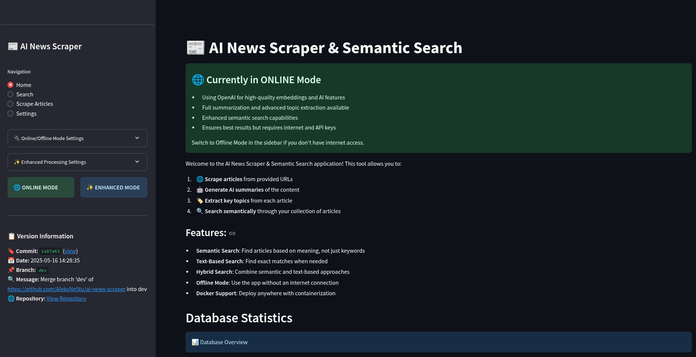

# 📰 AI News Search

> Scrape, summarize, and semantically search your personal news library. FastAPI + Next.js 15 + ChromaDB monorepo.

[](LICENSE)
[](https://nextjs.org)
[](https://fastapi.tiangolo.com)
[](https://www.trychroma.com)

---

## What is this?

AI News Search is a **personal semantic news library**:

- **Scrape** any URL → headline, body, AI summary (100–300 words), topics, vector embedding.
- **Semantic search** across your private article library — "what did I read 3 weeks ago about AI regulation?" returns relevant results by meaning, not keyword.
- **RSS subscriptions** with auto-polling (15-min cadence).
- **JWT auth** — your library stays yours.
- **Public OSS** — MIT license, this repo doubles as a portfolio signal.

See [`docs/PROJECT_RULES.md`](docs/PROJECT_RULES.md) for the public/private boundary policy.

## 🚀 Quick Start

```bash
git clone https://github.com/AleksNeStu/ai-news-scraper.git
cd ai-news-scraper

cp .env.example .env
# edit .env — set OPENAI_API_KEY (required) + JWT_SECRET (any long random string)

docker compose up -d
open http://localhost:3000
```

That's it — Postgres + Redis + ChromaDB + API + Web come up together. Register an account, scrape a URL, search.

## 🏗️ Architecture

```
┌─────────────────────────────────────────────────┐
│  Next.js 15 (App Router)         localhost:3000 │
│  • /scrape   • /search   • /articles            │
│  • /feeds    • /settings • /login  • /register │
└────────────────┬────────────────────────────────┘
                 │  HTTP (JWT cookie)
                 ▼
┌─────────────────────────────────────────────────┐
│  FastAPI (Python 3.12+)         localhost:8082 │
│  /scrape  /articles  /search  /feeds  /auth    │
│  → ChromaVectorStore  → Postgres (async)       │
│  → OpenAI gpt-4o-mini + text-embedding-3-small  │
│  → Redis cache (5-min search TTL)               │
└─────────────────────────────────────────────────┘
```

Monorepo layout:

```
apps/
├── api/          FastAPI backend (port 8082)
└── web/          Next.js 15 frontend (port 3000)
packages/
└── shared/       TS types shared between api + web
docs/             Project documentation
.github/          CI workflows + community files
```

## ⚙️ Stack

| Layer | Choice |
|---|---|
| Frontend | Next.js 15, React 19, TypeScript, Tailwind v4, shadcn/ui |
| Backend | FastAPI, Pydantic v2, SQLAlchemy 2.x async, asyncpg |
| Vector DB | ChromaDB (persistent, metadata filtering) |
| RDB | Postgres 16 |
| Cache | Redis |
| Auth | JWT (httpOnly cookies) + bcrypt |
| AI | OpenAI (gpt-4o-mini + text-embedding-3-small) |
| RSS | feedparser + APScheduler |
| Workspace | pnpm + Poetry |

## 🔧 Development

### Local dev scripts (cross-platform)

The `scripts/dev/` directory wraps `docker compose` with healthcheck waits
and clear URLs — the same workflow on Linux, macOS, and Windows.

```bash
# Linux / macOS
bash scripts/dev/run.sh           # app stack
bash scripts/dev/run.sh --monitor # also Uptime Kuma
bash scripts/dev/run.sh --logs    # then tail logs (Ctrl-C to exit)
bash scripts/dev/stop.sh          # stop (--volumes to wipe data)
bash scripts/dev/logs.sh api      # tail one service
bash scripts/dev/status.sh        # one-shot snapshot

# Windows (PowerShell)
pwsh scripts/dev/run.ps1
pwsh scripts/dev/run.ps1 -Monitor
pwsh scripts/dev/run.ps1 -Logs
pwsh scripts/dev/stop.ps1
pwsh scripts/dev/logs.ps1 api
pwsh scripts/dev/status.ps1
```

All scripts print `http://localhost:3000` (web) and `http://localhost:8082`
(api) once the stack is healthy. The default dev login is
`alex@example.com` / `dev-only-do-not-use-in-prod` (seeded by the
one-shot `migrate` service).

### Bare docker compose

If you don't want the wrappers:

```bash
docker compose up -d
# then wait for healthchecks, open http://localhost:3000
```

### API only / Web only (no docker)

```bash
# API only
cd apps/api
poetry install
poetry run uvicorn api.main:app --reload

# Web only
cd apps/web
pnpm install
pnpm dev
```

### Tests & lint

```bash
# Tests
cd apps/api && poetry run pytest
cd apps/web && pnpm test

# Lint
cd apps/api && poetry run ruff check .
cd apps/web && pnpm lint && pnpm typecheck
```

See [`CONTRIBUTING.md`](CONTRIBUTING.md) for the PR process.

## 🚀 Production deploy

Production runs on Render free tier via Blueprint (`render.yaml`). Render auto-deploys on every push to `main`. Same `docker-compose.yml` powers local dev.

- **Live URL**: `https://ai-news-scraper-web.onrender.com` (api: `https://ai-news-scraper-api.onrender.com`).
- **Blueprint definition**: `render.yaml` at repo root.
- **Runbook**: [`docs/operations/deploy.md`](docs/operations/deploy.md).

### What runs where

| Service | Render resource | Plan | Port |
|---|---|---|---|
| `web` (Next.js) | `type: web` (`ai-news-scraper-web`) | free | 10000 (Render default) |
| `api` (FastAPI) | `type: web` (`ai-news-scraper-api`) | free | 8082 |
| `postgres` | `databases:` (`ai-news-scraper-db`) | free | 5432 (managed) |

Render auto-provisions TLS on `*.onrender.com` and reads `JWT_SECRET` / `UNSUBSCRIBE_JWT_SECRET` from `generateValue: true`. Per-provider API keys are operator-set via the dashboard (the `sync: false` keys in `render.yaml`). ChromaDB runs embedded inside the api container (PersistentClient) on Render free — durable storage needs a paid tier with persistent disk (filed as follow-up).

## 📚 Documentation

| File | What |
|---|---|
| [`CONTRIBUTING.md`](CONTRIBUTING.md) | Public contributing guide, PR process, commit convention |
| [`docs/PROJECT_RULES.md`](docs/PROJECT_RULES.md) | **Hard rules** — public/private boundary, git hygiene, branch discipline |
| [`docs/PRD.md`](docs/PRD.md) | Product requirements (legacy v2.0) |
| [`docs/CI-CD.md`](docs/CI-CD.md) | CI/CD documentation |
| [`docs/TASKMASTER_GUIDE.md`](docs/TASKMASTER_GUIDE.md) | TaskMaster workflow guide |
| [`docs/TASK_MANAGEMENT.md`](docs/TASK_MANAGEMENT.md) | Task tracking |
| [`docs/COMPREHENSIVE_TODO.md`](docs/COMPREHENSIVE_TODO.md) | Roadmap (open gaps) |
| [`docs/COMPETITIVE_ANALYSIS.md`](docs/COMPETITIVE_ANALYSIS.md) | Competitive landscape |
| [`SECURITY.md`](SECURITY.md) | Security disclosure policy |
| [`CHANGELOG.md`](CHANGELOG.md) | Release history |
| [`LICENSE`](LICENSE) | MIT License |

## 🎯 Target users

- **Research Analysts** — daily news digest + semantic recall across weeks of archives.
- **Content Managers** — RSS auto-import, curation, light analytics.
- **Developers / Data Scientists** — REST API, embedding playground, integration-friendly.

## 📸 Demo (legacy Streamlit UI)

The screenshots below are from the previous Streamlit UI (now removed). The new Next.js UI is at `localhost:3000` after `docker compose up`.

<div align="center">
  
  <p><em>Home screen</em></p>
</div>

## 🤝 Contributing

See [`CONTRIBUTING.md`](CONTRIBUTING.md). All contributions are licensed under [MIT](LICENSE).

## 📄 License

[MIT](LICENSE) — Copyright (c) 2026 AleksNeStu.
